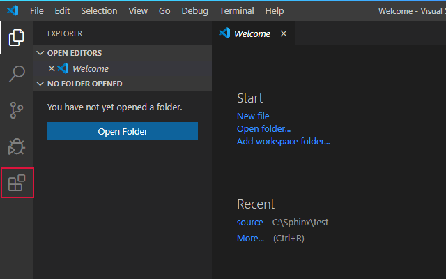
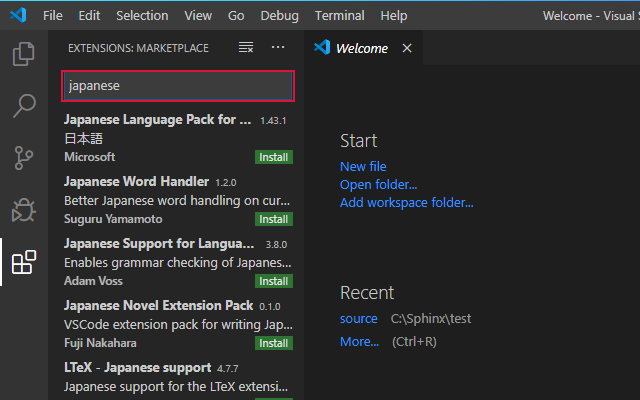
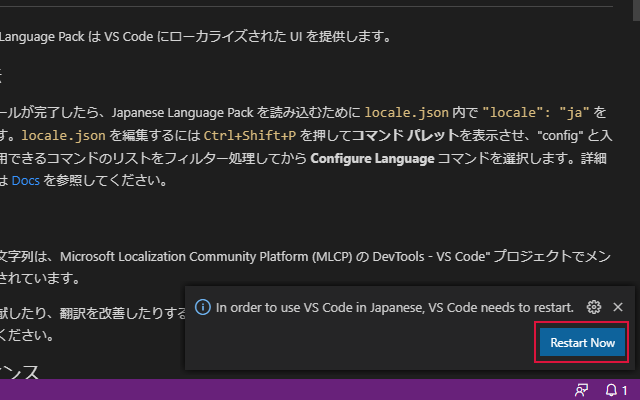
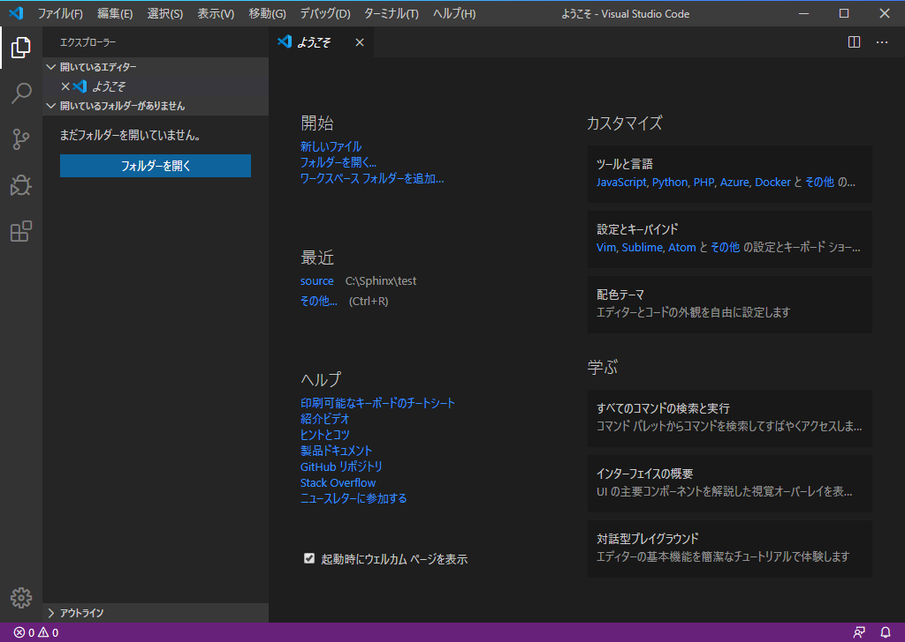

.. vscode-ja:

Visual Studio Code の日本語化
====================================================================================================

1. :guilabel:`Extensions` をクリック
----------------------------------------------------------------------------------------------------

2. テキストボックスに "japanese" と入力
----------------------------------------------------------------------------------------------------

3. "Japanese Language Pack for Visual Studio Code" をクリック
----------------------------------------------------------------------------------------------------

4. :guilabel:`Install` をクリック
----------------------------------------------------------------------------------------------------

5. :guilabel:`Restart Now` をクリック
----------------------------------------------------------------------------------------------------

6. VS Code が再起動　→　日本語化終了
----------------------------------------------------------------------------------------------------

